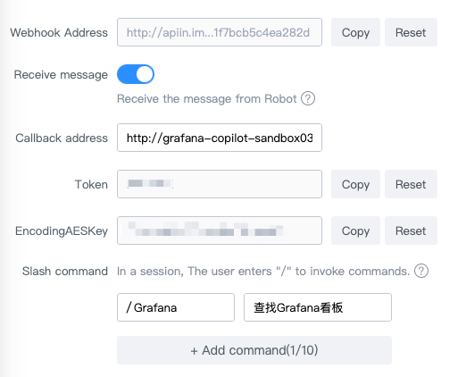
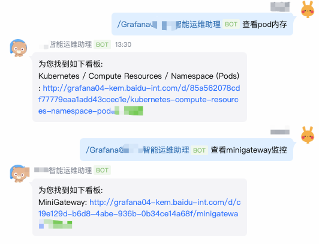

# Grafana Copilot

一个简单的AI驱动的Grafana看板查找工具。通过集成到企业消息机器人中，提供看板内容的智能搜索能力。

## 核心功能

当用户希望查看某类型的看板时，通过消息机器人回调获取用户输入，然后调用 Grafana 的 API 获取所有的看板元信息（标题和链接）作为背景支持。
将用户输入和 Grafana 看板元信息一起提交给 LLM 进行智能分析，并返回最佳匹配看板链接，然后通过机器人消息返回给用户。

## 支持平台

### 百度如流机器人

从机器人的设置中获取相关配置。



直接通过斜杠命令触发看板搜索。



## 使用步骤

### 本地安装

```shell
# 获取二进制
go install github.com/jemygraw/grafana-copilot@latest
# 配置环境变量，参考 env.sh 里面内容
source ./env.sh
# 启动服务
$GOPATH/bin/grafana-copilot
```

### 容器部署

构建镜像。

```shell
docker build -t grafana-copilot:1.0 .
```

启动容器。

```shell
docker run --env GRAFANA_HOST=xxx \
           --env GRAFANA_TOKEN=xxx \
           --env INFOFLOW_ROBOT_WEBHOOK_ADDRESS=xxx \
           --env INFOFLOW_ROBOT_TOKEN=xxx \
           --env INFOFLOW_ROBOT_ENCODING_AES_KEY=xxx \
           --env OPENAI_API_KEY=xxx \
           --env OPENAI_API_BASE=xxx \
           --env OPENAI_MODEL=xxx \
      -p 8080:8080 grafana-copilot:1.0
```

其中有个可选环境变量 `GRAFANA_BASE_URL` 用于指定一个不同于 `GRAFANA_HOST` 的域名，这个域名用于构造看板链接（因为 Grafana 有时会使用不同的域名进行跳转）。

### Kubernetes 部署

过于简单，不再赘述。